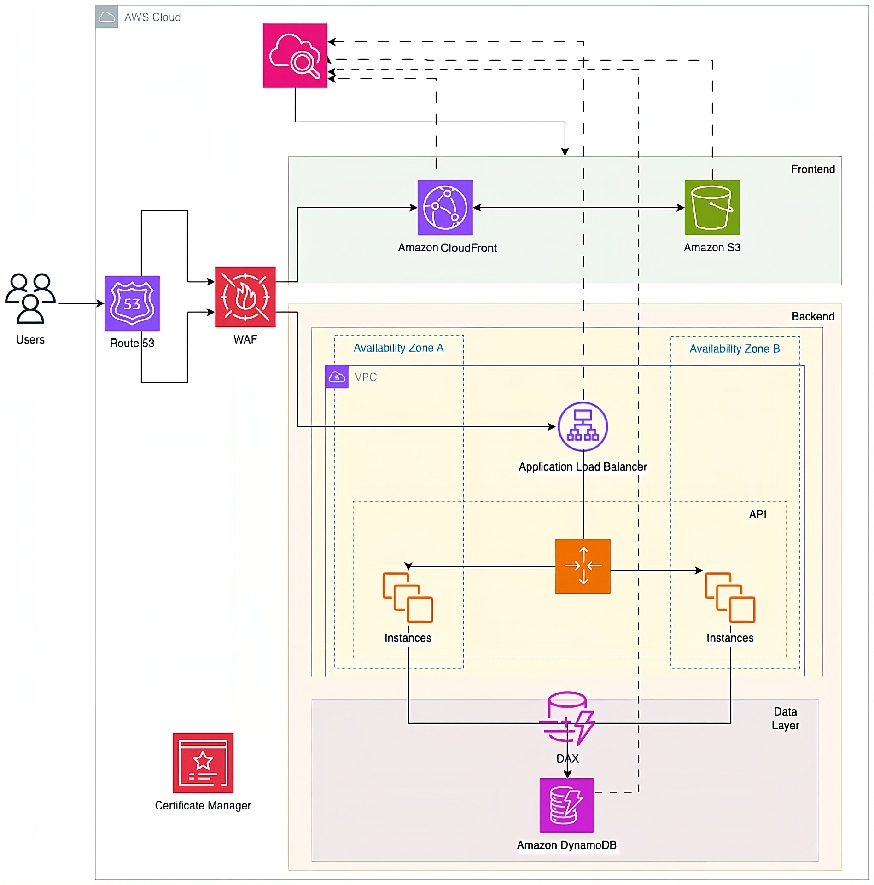

# Recipe Three-Tier Architecture — Cloud Platform 🚀

[](https://aws.amazon.com/)
[](https://reactjs.org/)
[](https://fastapi.tiangolo.com/)
[](https://www.docker.com/)
[](https://www.typescriptlang.org/)

About 📝

Recipe Three-Tier Architecture is a reference implementation and learning resource that demonstrates how to build a scalable three-tier web application on AWS. It includes a static frontend, an application/API layer, and a data layer, with examples for local development (Docker), infrastructure-as-code (CloudFormation & Terraform), and deployment guidance. This repo is ideal for:

- Developers learning modern web architecture patterns
- Teams prototyping an AWS-based web app
- Instructors teaching cloud architecture or DevOps practices

Core components 🔧

- Presentation (Frontend) — React + Vite (TypeScript). A single-page application that consumes the backend API.
- Application (Backend) — FastAPI (Python). Exposes REST endpoints used by the frontend and demonstrates common patterns (routing, validation, error handling).
- Data (Persistence) — DynamoDB (example). Infrastructure examples in CloudFormation and Terraform show how to provision resources.

Project information ℹ️

- Repository: https://github.com/Abdelrahman-Adnan/recipe-three-tier-architecture
- Primary language: TypeScript
- Languages breakdown: TypeScript 72.3%, HCL 13.5%, Shell 6.4%, Python 3.7%, Dockerfile 1.9%, Makefile 1.6%, CSS 0.6%
- Latest commit: `1d1dbfe` (see commits on GitHub)
- License: MIT

## Repository structure 📁

```
recipe-three-tier-architecture/
├── backend/                # FastAPI application
│   ├── main.py
│   └── requirements.txt
├── frontend/               # React + Vite SPA
│   ├── package.json
│   └── src/
├── platform/               # CloudFormation template(s)
│   └── cloudformation.yaml
├── terraform/              # Terraform examples/deployments
├── docker-compose.yml      # Local orchestration
├── Dockerfile              # Multi-service build example
├── Makefile                # Convenience targets
└── README.md
```

## Architecture 🏛️



High-level AWS three-tier architecture used in this project: static frontend hosting (S3) served through CloudFront, application layer behind an Application Load Balancer (ALB) running FastAPI service, and DynamoDB for persistence. The examples show both local development and IaC for cloud deployment.


## Quickstart (local development) ⚡

Prerequisites: Docker, Node.js (16+), Python 3.10+

Start the entire stack with Docker Compose (recommended for a consistent dev environment):

```bash
# from repository root
docker-compose up --build
```

This will build and run frontend and backend services. The frontend is served on the port defined in the compose file (commonly 5173 for Vite), and the backend on port 8000 by default.

Detailed frontend & backend local development (without Docker)

Frontend (local development):

```bash
cd frontend
# install dependencies
npm install
# run dev server (Vite)
npm run dev
# build for production
npm run build
```

Notes:
- The dev server typically runs at http://localhost:5173 — check console output when starting.
- To point the frontend to a locally-running backend, update `frontend/.env` or the API base URL in the app (see frontend README or config).

Backend (local development):

```bash
cd backend
# create and activate virtualenv (Unix/macOS)
python -m venv .venv
source .venv/bin/activate
# Windows (PowerShell)
# python -m venv .venv
# .\.venv\Scripts\Activate.ps1

# install requirements
python -m pip install -r requirements.txt

# run with autoreload
uvicorn main:app --reload --port 8000
```

The API is available at http://localhost:8000 and includes interactive docs at http://localhost:8000/docs (Swagger UI) and http://localhost:8000/redoc (ReDoc) if enabled.

Environment variables & configuration ⚙️

- Backend: create a `.env` file in `backend/` or set environment variables for any configuration values (e.g., AWS credentials, DynamoDB endpoint for local testing, API keys).
- Frontend: create `frontend/.env` to override API base URL or environment-specific flags. Example contents:

```
VITE_API_BASE_URL=http://localhost:8000
```

Testing & linting 🧪

- Frontend: run your test suite (if included) and linters:

```bash
cd frontend
npm test
npm run lint
```

- Backend: run unit tests and linters (if present):

```bash
cd backend
pytest
flake8
```

## Makefile 🍳

A small set of `make` targets is included to simplify common tasks. Run from the repository root.

Key targets

- `make install` — install backend and frontend dependencies
- `make install-backend` — create a Python virtualenv and install backend requirements
- `make run-backend` — run the backend application (uses the virtualenv)
- `make install-frontend` — install frontend npm packages
- `make dev-frontend` — start the frontend dev server (Vite)
- `make build-frontend` — build the frontend for production
- `make up` — start services with docker-compose
- `make down` — stop services started by docker-compose
- `make help` — list available targets

Examples

```bash
# Install dependencies (backend + frontend)
make install

# Start frontend dev server
make dev-frontend

# Start the stack with Docker Compose
make up
```

## Docker 🐳

Useful commands:

```bash
# Run in foreground
docker-compose up --build

# Run detached
docker-compose up -d

# Stop
docker-compose down

# View logs
docker-compose logs -f backend
docker-compose logs -f frontend
```

Tips:
- Use `docker-compose logs -f` to tail logs for debugging.
- If you change code and want containers to rebuild, use `docker-compose up --build`.

## Deployment & Infrastructure (Cloud) ☁️

This repo includes example CloudFormation and Terraform templates in `platform/` and `terraform/` respectively. They are intended as starting points — review, secure, and customize before using in production.

Quick notes:
- CloudFormation: edit `platform/cloudformation.yaml` and deploy with AWS Console or CLI.
- Terraform: follow `terraform/README.md` for usage, variable setup, and deployment steps.

Security & production considerations 🔒

- Do not expose SSH (0.0.0.0/0) in production — restrict to known IPs.
- Add HTTPS/TLS to your load balancer for public endpoints.
- Use IAM roles and least-privilege policies for services accessing AWS resources.

## What’s included 📦

- `backend/` — FastAPI backend
- `frontend/` — React + TypeScript frontend
- `platform/` — CloudFormation template
- `terraform/` — Terraform examples
- `docker-compose.yml` — local orchestration

## Upcoming features 🚧

We're planning a set of improvements and features to make this reference project more complete and production-ready. Possible upcoming work includes:

- Authentication & Authorization (JWT / OAuth2) for secured API endpoints 🔐
- CI/CD pipeline examples (GitHub Actions) for automated builds, tests, and deployments ⚙️
- Production-ready Dockerfile and deployment guide for ECS/EKS or a managed service 🧭
- Observability: Prometheus metrics, Grafana dashboards, and centralized logging (CloudWatch / ELK) 📈
- Database seeding and demo data scripts to populate example recipes and users 🧾
- Multi-region and high-availability deployment patterns and autoscaling examples 🌍
- Mobile-friendly frontend improvements and PWA support 📱

If you'd like to see any of these prioritized, open an issue or request a feature.

## Special Thanks 🙏

Special thanks to Manara for their support and resources used in this project.

## License ⚖️

See the `LICENSE` file in the repository root.
